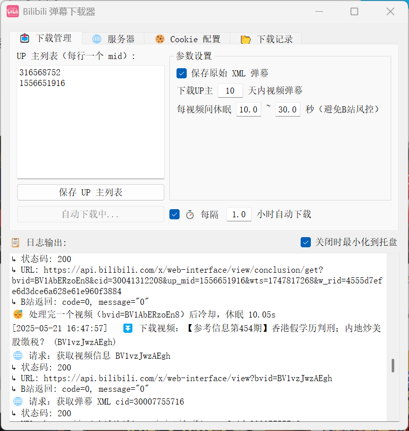
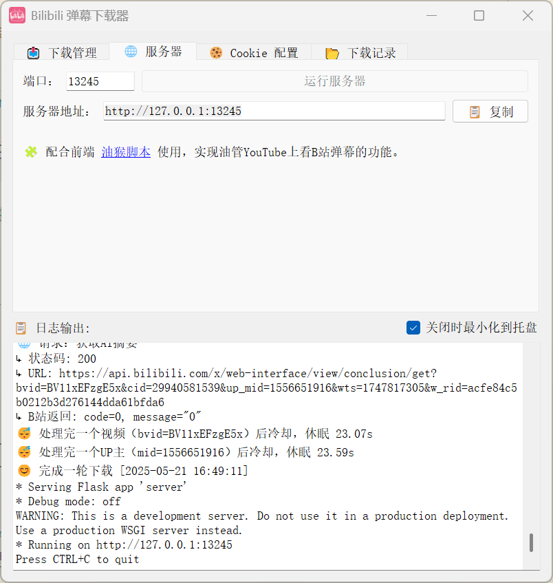
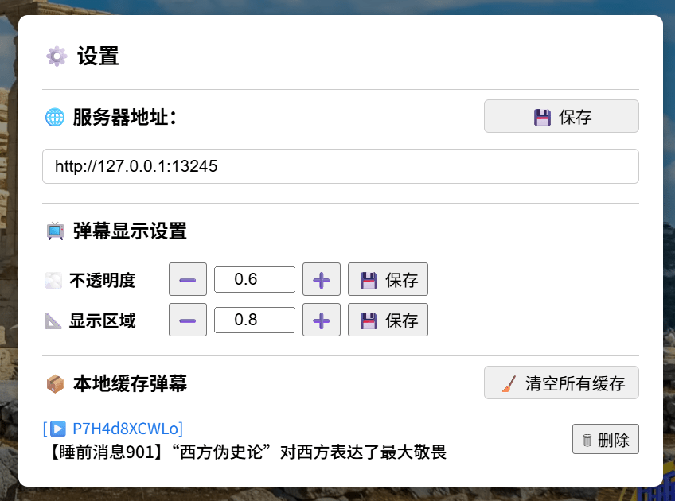
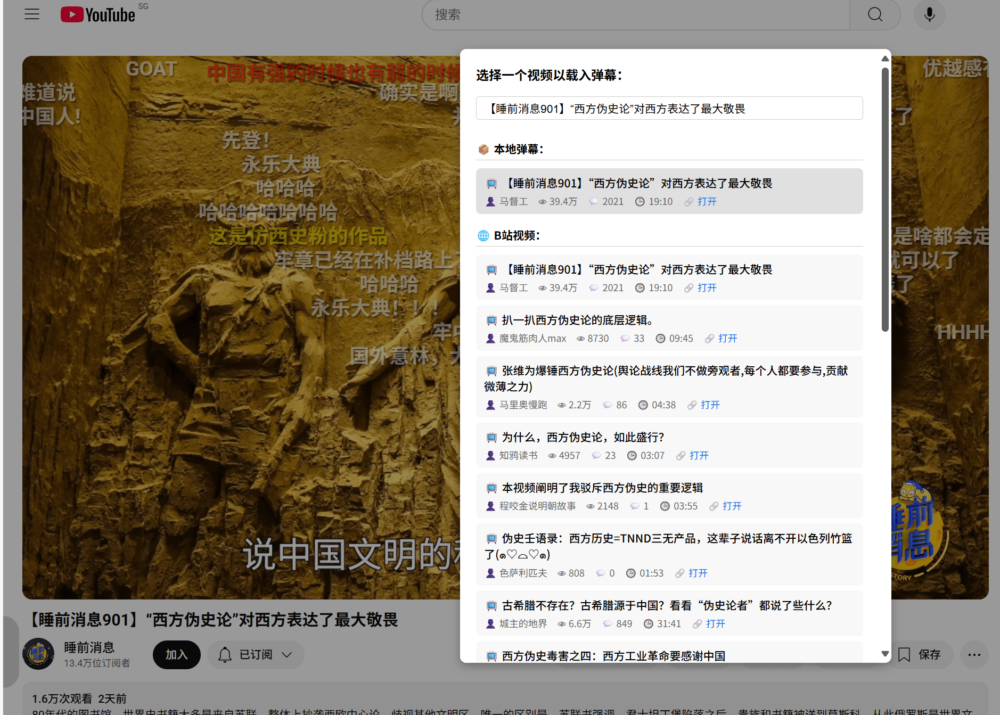
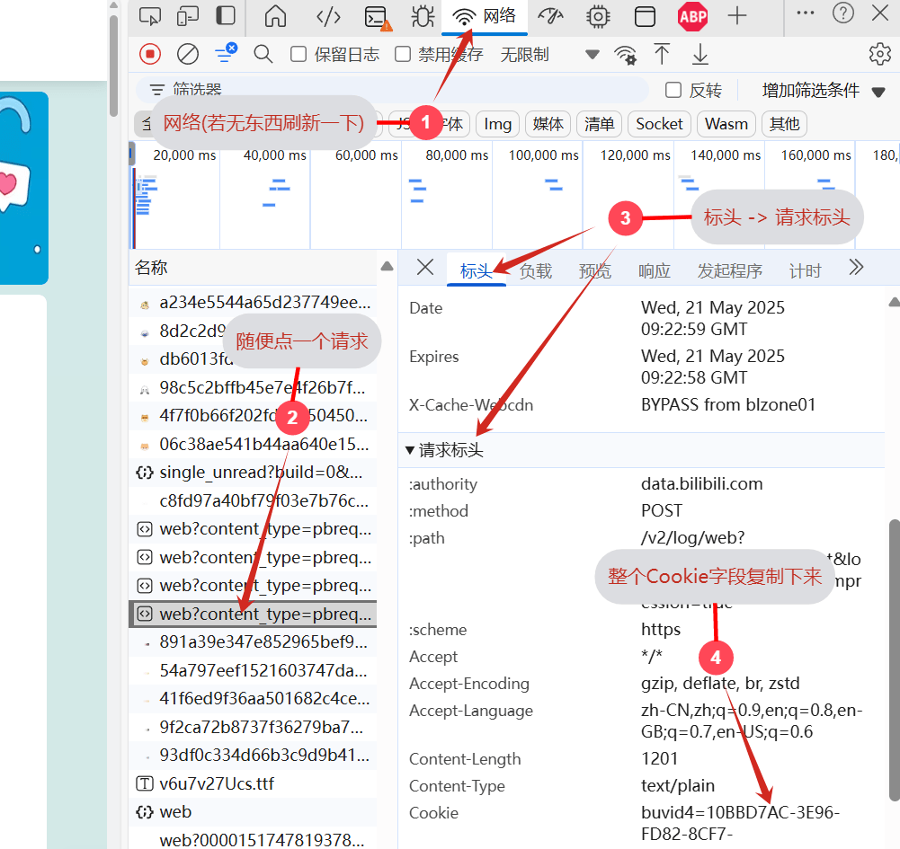

# 🎬 Bilibili 弹幕采集与播放

本项目是一个完整的系统：从 **B 站弹幕爬取**，到 **弹幕查询 API 服务**，再到 **前端油猴脚本在 YouTube 上显示弹幕**。

- ⏬ 自动抓取指定 UP 主的视频与弹幕（定时任务）
- 📡 提供接口供前端访问视频和弹幕内容（支持搜索 B站 & 本地弹幕资源）
- 🧩 Tampermonkey 脚本加载弹幕在 YouTube 视频上播放

> 如果你看的up主在两边都上传视频，且B站视频总有被删的风险，那么很适合本工具。不想用爬虫的话也可以用 [bilibili 视频弹幕统计](https://greasyfork.org/zh-CN/scripts/534432) 手动下载弹幕。

## ✨ 安装

### 后端（爬虫+服务器）

* 前往[发布页](https://github.com/ZBpine/bilibili-danmaku-download/releases)下载
* 如果想直接用，那么下载那个exe文件就行，不用安装，放进一个文件夹里直接运行就可以。
* 如果用不了或者想自己改，那就把Python源码下下来自己跑：
  * `downloader.py`是弹幕爬虫，`server.py`是弹幕查询服务器，这两个可以python直接单独运行
  * `gui_app.py`、`gui_main.py`是Qt写的带用户界面的程序。`gui_main.py`打包后就是发布页的exe

### 前端（YouTube播放弹幕）

1. 浏览器安装扩展`Tampermonkey`（[Edge的在这](https://microsoftedge.microsoft.com/addons/detail/%E7%AF%A1%E6%94%B9%E7%8C%B4/iikmkjmpaadaobahmlepeloendndfphd)）
2. Greasy Fork安装[YouTube B站弹幕播放器](https://greasyfork.org/zh-CN/scripts/536159)
3. 若不能正常使用，看看是不是因为扩展没开开发人员模式，详见[Tampermonkey Q209](https://www.tampermonkey.net/faq.php#Q209)

## ✨ 功能

### 1️⃣ 弹幕采集

* 定时采集指定 UP 主（支持多个up主）
* 获取视频信息、弹幕 XML、AI 摘要
* 转为 JSON 格式`BVxxxxx.json`
* 保存路径：`downloads/<mid>/<bvid>/`
> mid即用户ID，在用户主页`space.bilibili.com`的地址旁边

📄 详细说明：[📡 弹幕爬虫 README](./bilibili_crawler/README.md)

---

### 2️⃣ 弹幕查询 API 服务

* 此功能会在本地开一个服务器，配合前端[YouTube B站弹幕播放器](#3️⃣-油猴脚本youtube-显示-b-站弹幕)使用
* 服务器会同时查询本地下载下来的弹幕，以及B站的视频弹幕，发送给前端播放。
* 配置好[CooKie](#cookie-需求说明)，点击运行服务器即可开启

📄 详细说明：[📡 弹幕接口服务 README](./bilibili_crawler/README.md#-bilibili-弹幕接口服务serverpy)

---

### 3️⃣ 油猴脚本：YouTube 显示 B 站弹幕

* 可将前面爬取的弹幕用于油管显示
* 安装脚本后，打开任意 YouTube 视频
* 两种使用方法，一种直接打开本地弹幕文件，一种需要启动[本地服务器](#2️⃣-弹幕查询-api-服务)
  * 第一种：点击悬浮控制面板 → 载入弹幕 -> 选择本地 BVxxxx.json 弹幕文件
  * 第二种：配置服务器地址 → 点击🔍直接搜索B站同名视频弹幕&下载到本地的弹幕
* 弹幕将自动与视频播放同步

📄 详细说明：[📎 油猴脚本 README](./tampermonkey/README.md)

### 🍪 关于Cookie

#### 📄 Cookie 需求说明：

- **下载弹幕功能**
  - 可设置也可以不设置 Cookie。
  - 如果设置了已登录的 Cookie，可下载额外信息，如 UP 主信息、AI 总结等（非必要数据）。
  - 未设置 Cookie 或使用未登录 Cookie，也能下载弹幕，但不能下载额外信息。

- **服务器功能**
  - 必须设置 Cookie，否则搜索接口无法使用。
  - 已登录或未登录状态的 Cookie 都可以。

#### 🛠️ 获取Cookie方法

1. 浏览器打开B站（若要获取未登录的Cookie可以用无痕浏览打开B站）
2. F12打开开发者工具
3. 选择网络 -> 随便选一个请求 -> 请求标头 -> 复制整段Cookie

