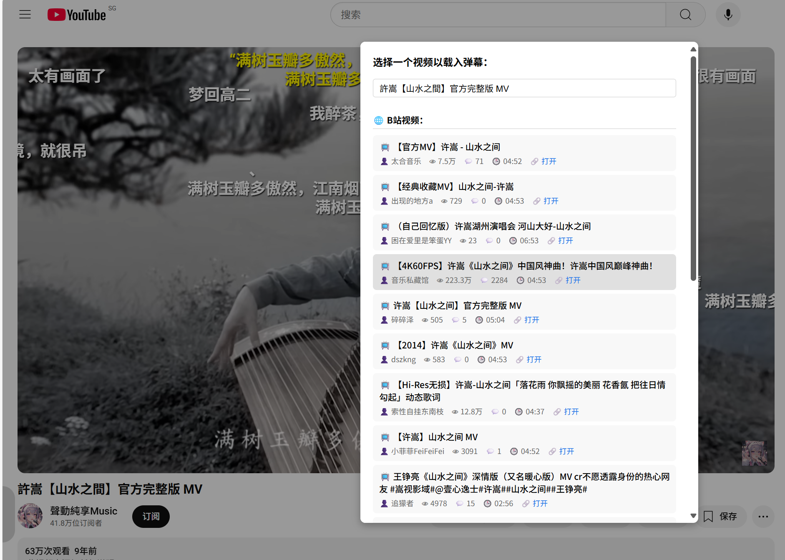

# 🎬 YouTube 弹幕播放脚本（加载本地 B站 弹幕）

> 一款用于在 YouTube 上加载本地B站弹幕并显示同步弹幕的油猴用户脚本（配合 [B站弹幕爬虫](../bilibili_crawler/README.md) 或 [B站弹幕下载脚本](https://greasyfork.org/zh-CN/scripts/534432-bilibili-%E8%A7%86%E9%A2%91%E5%BC%B9%E5%B9%95%E7%BB%9F%E8%AE%A1-%E4%B8%8B%E8%BD%BD-%E6%9F%A5%E8%AF%A2%E5%8F%91%E9%80%81%E8%80%85) 获取B站弹幕），支持顶部/底部弹幕、颜色字号等功能。


## ✨ 功能特色

* ✅ 加载本地弹幕（由 B 站弹幕 XML 转换而成的 `.json`）
* ✅ 自动同步弹幕播放，自动分配弹幕轨道，防止重叠
* ✅ 支持顶部 / 底部 / 滚动弹幕，支持显示弹幕颜色、字号
* ✅ 支持缓存弹幕，下次打开页面自动恢复
* ✅ 支持快捷键`D`开关弹幕
* ✅ 支持配置[服务器](../bilibili_crawler/README.md#-bilibili-弹幕接口服务serverpy)地址，通过服务器搜索B站同名视频弹幕
* `1.3版本`支持在B站播放弹幕（倒不是脱裤子放屁，可以尝试在补档视频看原视频弹幕）


## 🖼️ 效果预览





## 🚀 使用方法

1. 安装浏览器插件 [Tampermonkey](https://www.tampermonkey.net/)
2. 新建用户脚本，粘贴本项目的 `userscript.js` 脚本内容
3. 打开任意 [YouTube 视频](https://www.youtube.com/watch)
4. 鼠标悬停在屏幕左边弹出的控制面板，点击：

   * 📂【载入弹幕】按钮，选择你的本地 `.json` 弹幕数据
   * ✅【弹幕开/关】可随时控制显示状态
5. 播放视频，弹幕将自动同步漂浮显示
6. 搜索B站同名视频弹幕功能需自行布置服务器（[`server.py`](../bilibili_crawler/server.py)）
7. 点击⚙️设置服务器地址，然后就可以点击🔍搜索B站同名视频获取弹幕了。可以修改标题，enter重新搜索。

## 📦 弹幕文件要求

请使用你自己的爬虫工具或手动下载，生成如下格式的 JSON：

```json
{
  "bvid": "BV1xx4117xYz",
  "cid": 12345678,
  "videoData": {
    "title": "...",
    "pic": "...",
    ...
  },
  "danmakuData": [
    {
      "progress": 12340,
      "mode": 1,
      "fontsize": 25,
      "color": 16777215,
      "ctime": 1615020559,
      "pool": 1,
      "midHash": "abcdef",
      "dmid": "123456789",
      "weight": 0,
      "content": "哈哈哈哈"
    }
  ],
  "fetchtime": 1747363751
}
```

> YouTube不让脚本用DOMParser处理本地xml文件，所以需要预先转为json。
> 
> 其中必须含有danmakuData，其他数据可选。
> 
> 处理弹幕xml可参考 [BiliBili XML弹幕](https://github.com/SocialSisterYi/bilibili-API-collect/blob/master/docs/danmaku/danmaku_xml.md) 。


